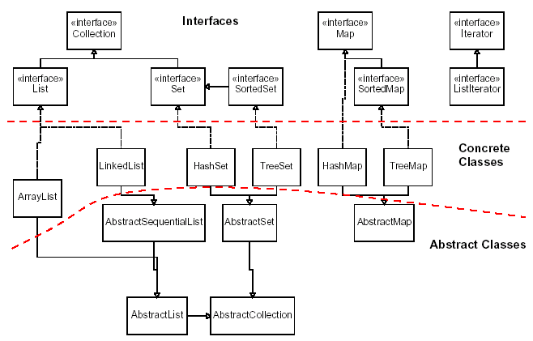

# 14 October

## Polymorphism

- Recall how inheritance works: subclasses inherit from superclass.
- Constructors are the only thing not inherited
  - along with private fields / methods
- New subclasses are given a default constructor:

```java
public SubClass() {
    super();
}
```

- We can see how this will cause issues if super-class has more than a single
zero-argument constructor.

How inheritance allows some Polymorphism:

- methods that take a superclass as argument can take any subclass as that
argument (for compiler checks)
- arrays of a superclass can contain a mixture of subclasses

### Comparing objects

Objects inheriting from `Object` have a default "equals" function, that compares
on *addresses*, so usually an object will only be equal to itself. If we want to
check for equality on the *fields* of an object, we must override this function.

To check ordering of objects, we must define or override the `compareTo`
function.

### Collections

- "Collections" in Java are "objects that store data" (AKA data structures).
Individual chunks of data are called "elements" in the collection.
- typically have methods such as `add`, `remove`, `contains`, etc.
- imported with `import java.util.*`
- If collection can be sorted or if we can use `binarySearch`, elements must be
`Comparable`: need to implement `compareTo` method



## Interfaces

- Interfaces are another way to enforce an "is-a" relationship
  - Ex: all circles are shapes, not all shapes are circles
- Use inheritance for code re-use, use interfaces when objects have the same
high-level functions but code will be implemented differently
  - Ex: calculating area of circle vs calculating area of square

Define only class name, method names and types:

```java
public interface MyInterface {
    public type MyInterfaceMethod(type argname, ...);
}
```

We instantiate interfaces using the `implements` keyword, instead of the
`extends` keyword we used with direct inheritance. For example:

```java
public class Trapezoid implements Shape {
  ...
}
```

- Think of interfaces as a *contract* that guarantees what methods our custom data
type will have.
- Any collections that implement `binarySearch` require the ability to sort the
data structure, meaning we need to compare the objects in the collection.
- Java docs show that this interface is called `Comparable`. It looks like:

```java
public interface Comparable<E> {
    public int compareTo(E other);
}
```

- `compareTo` is the function we must write if a new data type `implements Comparable`.
- `A.compareTo(B)` returns a positive integer if A > B
- `A.compareTo(B)` returns a negative integer if A < B
- `A.compareTo(B)` returns zero if the objects are considered equal in rank.

Note that the interface for `Comparable` used a generic type E to specify that
`compareTo` takes an object of the same type as an argument. What are generic
types?

## Type Parameters (Generics)

Instead of declaring objects with a specific type, we can define Abstract Data
Types (ADTs) that can take in any time. Collections in Java are implemented this
way. For example, ArrayList:

```java
ArrayList<E> name = new ArrayList<E>();
```

Any *object type* can be put in place of `E`. The only types that aren't object
types are primitives, including `int`, `double`, `char`, and `boolean`. Luckily,
the Java developers have created corresponding Object types for these
primitives, namely `Integer`, `Double`, `Character`, and `Boolean`,
respectively.

To make our own generic classes, we simply use the bracket notation and the
naming convention:

- T: type
- E: element
- K: key
- N: number
- V: value

Generics have several advantages, including automatic type-casting, and
type-safety checks performed at compile time.
