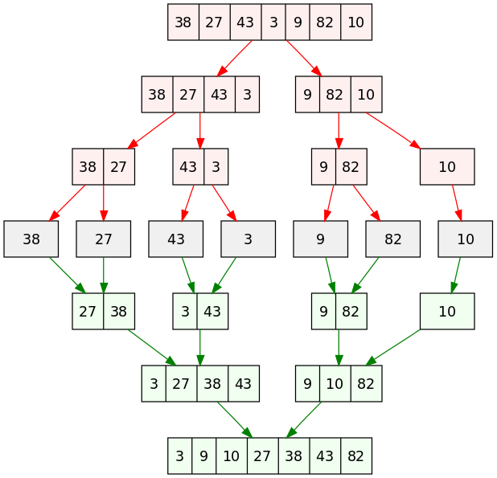

# 14 October

## Polymorphism

- Recall how inheritance works: subclasses inherit from superclass.
- Constructors are the only thing not inherited
  - along with private fields / methods
- New subclasses are given a default constructor:

```java
public SubClass() {
    super();
}
```

- We can see how this will cause issues if super-class has more than a single
zero-argument constructor.

How inheritance allows some Polymorphism:

- methods that take a superclass as argument can take any subclass as that
argument (for compiler checks)
- arrays of a superclass can contain a mixture of subclasses

### Comparing objects

Objects inheriting from `Object` have a default "equals" function, that compares
on *addresses*, so usually an object will only be equal to itself. If we want to
check for equality on the *fields* of an object, we must override this function.

To check ordering of objects, we must define or override the `compareTo`
function.

### Collections

- "Collections" in Java are "objects that store data" (AKA data structures).
Individual chunks of data are called "elements" in the collection.
- typically have methods such as `add`, `remove`, `contains`, etc.
- imported with `import java.util.*`
- If collection can be sorted or if we can use `binarySearch`, elements must be
`Comparable`: need to implement `compareTo` method


## Interfaces

- Interfaces are another way to enforce an "is-a" relationship
  - Ex: all circles are shapes, not all shapes are circles
- Use inheritance for code re-use, use interfaces when objects have the same
high-level functions but code will be implemented differently
  - Ex: calculating area of circle vs calculating area of square

Define only class name, method names and types:

```java
public interface MyInterface {
    public type MyInterfaceMethod(type argname, ...);
}
```

We instantiate interfaces using the `implements` keyword, instead of the
`extends` keyword we used with direct inheritance. For example:

```java
public class Trapezoid implements Shape {
  ...
}
```

- Think of interfaces as a *contract* that guarantees what methods our custom data
type will have.
- Any collections that implement `binarySearch` require the ability to sort the
data structure, meaning we need to compare the objects in the collection.
- Java docs show that this interface is called `Comparable`. It looks like:

```java
interface Comparable<E> {
    public int compareTo(E other);
}
```

- `compareTo` is the function we must write if a new data type `implements Comparable`.
- `A.compareTo(B)` returns a positive integer if A > B
- `A.compareTo(B)` returns a negative integer if A < B
- `A.compareTo(B)` returns zero if the objects are considered equal in rank.

Note that the interface for `Comparable` used a generic type E to specify that
`compareTo` takes an object of the same type as an argument. What are generic
types?

## Type Parameters (Generics)

Instead of declaring objects with a specific type, we can define Abstract Data
Types (ADTs) that can take in any time. Collections in Java are implemented this
way. For example, ArrayList:

```java
ArrayList<E> name = new ArrayList<E>();
```

Any *object type* can be put in place of `E`. The only types that aren't object
types are primitives, including `int`, `double`, `char`, and `boolean`. Luckily,
the Java developers have created corresponding Object types for these
primitives, namely `Integer`, `Double`, `Character`, and `Boolean`,
respectively.

To make our own generic classes, we simply use the bracket notation and the
naming convention:

- T: type
- E: element
- K: key
- N: number
- V: value

Generics have several advantages, including automatic type-casting, and
type-safety checks performed at compile time.

\newpage

# 16 October

recap of abstraction techniques:

- inheritance (`extends`)
- interfaces (`implements`)
- type parameters ("generics")
- abstract classes

Didn't actually learn about abstract classes yet, so:

## Abstract Classes

- Use modifier `abstract` when defining a class
- abstract methods can only exist within an abstract class and are not implemented
- abstract classes cannot be instantiated, only inherited

Compare and contrast with interfaces:

- Abstract classes are "blueprints" while interfaces are "contracts"
  - abstract classes can have some methods fully implemented and some abstract (just declared, not implemented)
  - all interface classes and methods are implicitly public, while abstract classes can have any access modifier
- Multi-inheritance
  - classes cannot inherit from more than one other class (abstract or not), but *can* implement multiple interfaces
  - Interfaces declare only which methods must be implemented (and their type), while abstract classes can have more state
    (some concrete methods, fields and variables)
- Interfaces are one of the few things in Java that are *not* a class
- Can use generics (type parameters) with both abstraction methods

For the most part, you're just getting exposed to these concepts in this class:
take Software Engineering classes to see more about how they are used in
practice to good effect!

## Break to Stretch

## Merge Sort, Quick Sort

- Quick sort: choose pivot (how?), divide into two sets of elements above and below pivot
- Merge sort: divide in half, recursively until arrays of size one or two, then
merge together in sorted order
- look at visualizations
- Quick sort: worst case, O(n**2) if bad pivot chosen every time
- Merge sort: T(n) = 2T(n/2) + n
  - This recurrence leads to O(n log(n))
  - look at diagram to get intuition why: we have log(n) levels, approx n operations at each level
  - can be optimized by finding and making use of *runs*: subsequences of sorted elements
- Runs are also used by TimSort (default sort algorithm in Python until 2022)
  - split array based on runs, maintain four runs on top of a stack to maintain balanced merges
  - 2015 researchers used formal verification to find bug resulting in array-out-of-bounds
    for certain inputs (smallest is $2^{26}$ (~67 million), $2^16$ on Android - only ~65k)
  - 2022: switch to PowerSort, researchers found a provably optimal merge-ordering strategy



## Non-Comparative Sorting

- Proven worst-case big O runtime for comparative sorting is O(n log n)
  - (look at runtimes on geogebra)
- What if I told you... there was a way to sort without comparing!
- Example: 20000, 10, 5500, 100
- Example: 20, 10, 10, 50
- Think about sorting books in alphabetical order by author: we might make
shelves for A-F, F-L, M-R, S-Z
  - We also wouldn't put the first "B" author right next to the last "A" author:
    we'd leave some space. We could go through our stack of books first and
    count how many go into each "shelf" if we wanted to be really efficient and avoid
    moving books on the shelf around.

## Counting Sort

- Input: collection of *n* items (values) with non-negative integer keys
  - maximum value of keys is bounded by *k*
  - if not provided, can find by one O(n) loop over keys
- If all items are unique, we could use our original naive hash table idea:
store value with key *i* at index *i* in array
  - this will automatically sort by key
  - how to "leave space" for duplicate items?

Example: 5, 3, 1, 5

- Create two auxiliary arrays: count (array of k+1 zeros), and output (same
length as input).
- Loop over input to count the number of values with each key, log in `count` at
index corresponding to each key
- Loop over `count` and store a cumulative sum in-place
- Loop over input in reverse, decrement `count[i]` and use as index for key `i`
  - reverse enables stable sort

Complexity: O(n+k)

\newpage

# 18 October

## Radix Sort

- radix = "base" (as in base-10)
- apply counting sort to digits of numbers, starting with most significant or
least significant
  - all numbers with 3 digits are larger than numbers with 2 digits
- sort into "buckets" for all numbers with same digits
- invented in **1887** for punch card systems
- computer algorithm developed in 1954 at MIT. Was previously considered
impractical because of need for dynamic memory allocation!

*watch more interactive viz*

*do worksheet*
